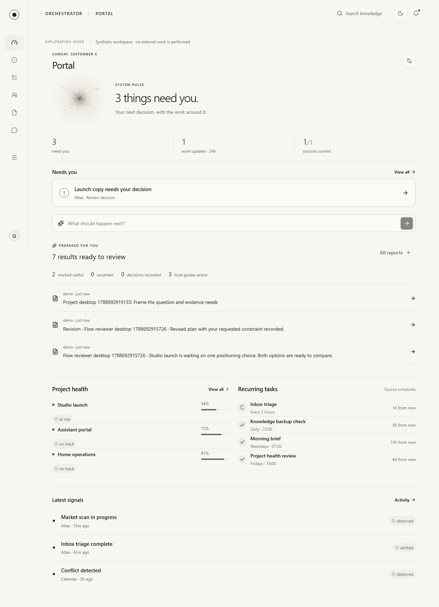

# Orchestrator

Orchestrator is a private, local-first portal to your assistants and their work. The beta adds prepared teams for every supported connection, automatic local briefs, dedicated assistant conversations, evidence-based reports and a complete simulated decision workflow in a calm monochrome workspace.

Beta 2 adds [personal project, money, coaching and agenda workflows](docs/personal-workflows.md), with bounded source-generated drafts and a shared Today view.

See the [beta guide](docs/beta.md), [research and acceptance scope](docs/beta-scope.md), and [beta validation](docs/beta-validation.md). Run `npm run demo` for a fresh populated workspace at port 4425. Source runtimes retain execution authority. The download links below refer to the previously published alpha; the beta is a local build until separately released.

Start with the [desktop download for Windows, macOS or Linux](https://github.com/QuintonD/orchestrator-portal/releases/tag/v0.1.0-alpha.2). It includes everything needed to run the gateway; Node, Git and build commands are not required. Follow the [desktop setup guide](docs/desktop.md).

For phone testing, install the signed Android APK from the same release and follow the [Android setup guide](docs/android.md). The app connects to your computer's gateway over USB or private HTTPS.

The portal is deliberately **not** another agent runtime or knowledge store. OpenClaw, Hermes, custom harnesses, and connected knowledge stores remain authoritative. Orchestrator connects to them through capability-based adapters and records exactly what was accepted, committed, observed, or independently verified.



## What is included

- A responsive, installable React interface with light and dark themes
- A customizable overview designed around exceptions and outcomes
- Assistant profiles with purpose, success criteria, provider mandates, and dispatch pause
- Reviewable reports, preserved revisions, and targeted corrections
- Bounded councils with independent assessments and a lead synthesis
- Persistent activity watches and scoped, revocable knowledge grants
- Direct assistant messaging with text attachments and explicit delivery receipts
- Project, routine, attention, usage, mail-summary, and provider-health views
- Guided connections with an immediate check and recoverable setup errors
- Full-text search over selected local documents, Obsidian vaults and Notion pages
- OpenClaw CLI, Hermes API, generic webhook and experimental gbrain adapters
- Guided Grok Bot handoffs and previewed manual result imports, preserved as claims
- Source-owned OpenClaw recurring briefs and deduplicated report import
- An editable context handoff to an independent T3 Code workspace
- An adapter SDK and stable shared contracts for other runtimes and knowledge stores
- Encrypted connector secrets and message content in a local SQLite database
- Passphrase authentication, HttpOnly sessions, CSRF protection, strict origins, CSP, rate limits, and an audit trail
- Bearer-key event ingestion for runtimes that push normalized events
- Server-sent updates without a cloud relay
- Docker and Tailscale Serve deployment paths
- No telemetry

The assistant channel carries the same operational context and evidence model into conversation:


## Quick start

1. Download and extract the [desktop bundle](https://github.com/QuintonD/orchestrator-portal/releases/tag/v0.1.0-alpha.2) for your computer.
2. Open `Orchestrator.cmd` on Windows, `Orchestrator.command` on macOS, or `./orchestrator` on Linux. Keep the launcher running.
3. Create your workspace in the browser that opens. In **Connections**, start with a local folder or Obsidian vault; no AI account is needed to search your notes.

For Notion, connect a read-only internal integration and choose individual pages. For Grok Bot, prepare a task, copy it into Grok Bot and import the result after reviewing its preview. See [knowledge setup](docs/knowledge.md) and [Grok Bot handoffs](docs/grok-bot.md).

The portable alpha downloads are unsigned. Workspace data is stored separately from the program, so replacing the extracted program preserves your workspace. [Desktop setup](docs/desktop.md) covers launch warnings, diagnostics, upgrades and commands an agent can use.

### Run from source

Contributors need Node.js 24 or newer and Git:

```bash
git clone https://github.com/QuintonD/orchestrator-portal.git
cd orchestrator-portal
npm ci
npm run build
npm start
```

Open `http://127.0.0.1:4400`, create the first local workspace, then add a connection. The server binds to loopback by default.

For a representative, non-production workspace:

```bash
npm run dev:demo
```

Demo mode is intentionally refused on non-loopback interfaces.

## How it fits

| Layer | Owns | Examples |
| --- | --- | --- |
| Orchestrator portal | Interaction, normalized signal, receipts, attention policy, layouts, audit | This project |
| Runtime adapter | Turns, task state, schedules, runtime health | OpenClaw CLI, webhook |
| Knowledge adapter | Search and source references | Local folders, Obsidian, Notion, gbrain CLI |
| Source system | Execution and source-of-truth policy | OpenClaw, custom agents, calendars, mail |

Assistant responses remain `claimed`; an ambiguous timeout is `unknown`. Source events preserve their reported states and evidence. A useful rating does not establish independent verification. The alpha has no general-purpose independent verifier.

## Connecting OpenClaw

Choose **OpenClaw** in Connections. The adapter uses the installed `openclaw` executable and its documented CLI surface:

- `openclaw agent --message ... --json` for assistant turns
- `openclaw tasks list --json` for background work
- `openclaw cron list --all --json` for recurring tasks

This keeps the integration compatible with the installed runtime rather than binding the portal to a beta SDK. Orchestrator does not read `~/.openclaw` configuration or credentials directly.

## Private remote access

Tailscale Serve is the recommended remote path. Keep Orchestrator on loopback and proxy it inside your tailnet:

```bash
tailscale serve --bg --https=443 http://127.0.0.1:4400
```

Add the resulting HTTPS origin to `ORCHESTRATOR_ALLOWED_ORIGINS`. Portal authentication remains required; tailnet membership is an additional boundary, not a replacement for app authentication. See [deployment](docs/deployment.md).

## Development

```bash
npm install
npm run dev:demo
npm run check
npm run build
npm run test:e2e
```

The repository is an npm-workspaces monorepo:

- `apps/server` — Fastify API, SQLite persistence, security, built-in adapters
- `apps/web` — React/Vite interface
- `packages/contracts` — validated public data contracts
- `packages/adapter-sdk` — provider capability interfaces
- `tests/e2e` — desktop and mobile browser coverage
- `research` — the research dossier that shaped the product boundaries

## Documentation

- [Product direction and prototype refinement proposal](docs/product-direction.md)
- [Shared product vocabulary](CONTEXT.md)
- [Architecture and evidence model](docs/architecture.md)
- [Adapter authoring](docs/adapters.md)
- [Security and privacy model](docs/security.md)
- [Deployment and backup](docs/deployment.md)
- [Research synthesis](research/00-executive-synthesis.md)
- [High-level research gap review](research/11-high-level-gap-review.md)
- [Evaluation benchmark](research/10-evaluation-benchmark.md)

## Project status

Version `0.1.0` is a production-oriented first release: real authentication, persistence, encryption, adapter boundaries, deployment assets, automated tests, and desktop/mobile visual QA are present. It is still young software. Use the benchmark in `research/10-evaluation-benchmark.md` before entrusting it with irreversible actions, and keep source runtimes responsible for authorization and execution policy.

Orchestrator is Apache-2.0 licensed. It contains no copied T3 Code implementation; T3 Code informed interaction and local-serving research only. See [THIRD_PARTY_NOTICES.md](THIRD_PARTY_NOTICES.md).
