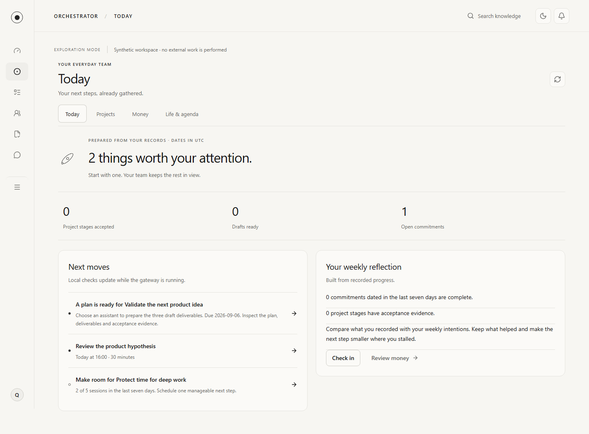
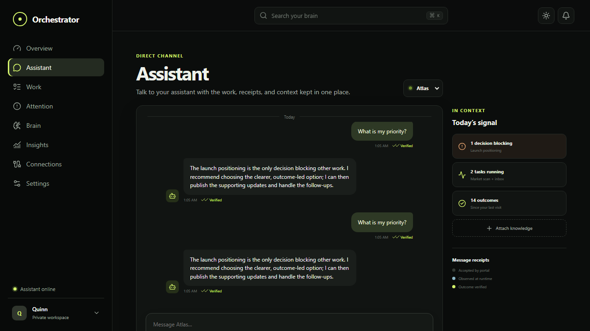

<h1 align="center">Orchestrator</h1>

<p align="center">A local-first home for your AI assistants and their work.</p>

<p align="center">
  <a href="https://github.com/QuintonD/orchestrator-portal/releases"><strong>All releases</strong></a> &middot;
  <a href="#download">Download</a> &middot;
  <a href="docs/README.md">Documentation</a> &middot;
  <a href="https://github.com/QuintonD/orchestrator-portal/discussions">Community</a>
</p>



<p align="center"><sub>Alpha preview using a synthetic workspace.</sub></p>

Follow assistant conversations, review reports and their evidence, and see which decisions need your attention. Orchestrator runs on your computer, with a browser interface and an Android companion. Connected runtimes keep control of execution and permissions.

**Alpha software.** Alpha 4 adds subscription and local model connections, with matching desktop and signed Android downloads. [Compare the builds](docs/releases.md) before downloading.

## Download

Desktop bundles include the runtime: no Node.js, Git, or build tools needed.

| Platform | Download alpha 4 | Setup |
| --- | --- | --- |
| Windows | [Intel / AMD](https://github.com/QuintonD/orchestrator-portal/releases/download/v0.1.0-alpha.4/orchestrator-0.1.0-alpha.4-win32-x64.zip) &middot; [ARM64](https://github.com/QuintonD/orchestrator-portal/releases/download/v0.1.0-alpha.4/orchestrator-0.1.0-alpha.4-win32-arm64.zip) | [Windows guide](docs/desktop.md) |
| macOS | [Apple silicon](https://github.com/QuintonD/orchestrator-portal/releases/download/v0.1.0-alpha.4/orchestrator-0.1.0-alpha.4-darwin-arm64.tar.gz) &middot; [Intel](https://github.com/QuintonD/orchestrator-portal/releases/download/v0.1.0-alpha.4/orchestrator-0.1.0-alpha.4-darwin-x64.tar.gz) | [Mac guide](docs/desktop.md) |
| Linux | [Intel / AMD](https://github.com/QuintonD/orchestrator-portal/releases/download/v0.1.0-alpha.4/orchestrator-0.1.0-alpha.4-linux-x64.tar.gz) &middot; [ARM64](https://github.com/QuintonD/orchestrator-portal/releases/download/v0.1.0-alpha.4/orchestrator-0.1.0-alpha.4-linux-arm64.tar.gz) | [Linux guide](docs/desktop.md) |
| Android | [Signed alpha APK](https://github.com/QuintonD/orchestrator-portal/releases/download/v0.1.0-alpha.4/orchestrator-0.1.0-alpha.4.apk) | [Phone setup](docs/android.md) |

**[Browse all releases, release notes, and assets](https://github.com/QuintonD/orchestrator-portal/releases)** &middot; [Checksums](https://github.com/QuintonD/orchestrator-portal/releases/download/v0.1.0-alpha.4/SHA256SUMS.txt) &middot; [Historical QA snapshots](docs/releases.md#android-qa-snapshots)

Desktop bundles are portable and unsigned. The Android app connects to the gateway on your computer; it does not run assistants on your phone. There is no stable release or automatic updater yet.

## Get started

1. Download the desktop archive for your computer and extract it completely.
2. Open `Orchestrator.cmd` on Windows, `Orchestrator.command` on macOS, or `./orchestrator` on Linux. Keep the launcher running.
3. Create your workspace in the browser that opens. Add a local folder or Obsidian vault in **Connections** to explore your notes without an AI account.

Next, [connect knowledge sources](docs/knowledge.md), [connect a runtime](docs/adapters.md), or [set up private phone access](docs/android.md). [Desktop setup](docs/desktop.md) covers launch warnings, upgrades, backups, and troubleshooting.

## What you can do

- **Follow your assistants.** Keep conversations, activity, and source delivery receipts together.
- **Review the work.** Inspect reports and evidence, ask for corrections, and preserve previous revisions.
- **Find your context.** Search selected local folders, Obsidian vaults, and Notion pages.
- **Keep decisions in view.** Use attention items, projects, routines, and bounded councils to review what needs you.

Alpha 3 adds prepared teams, automatic local briefs, and personal project, money, coaching, and agenda workflows. See the [prepared teams guide](docs/beta.md) and [personal workflows](docs/personal-workflows.md).

<details>
<summary>See the assistant conversation view</summary>



</details>

## Run the alpha from source

Install Node.js 24 or newer and Git, then run:

```bash
git clone https://github.com/QuintonD/orchestrator-portal.git
cd orchestrator-portal
npm ci
npm run demo
```

Open `http://127.0.0.1:4425` for a fresh synthetic workspace, separate from your real gateway data. Stop it with Ctrl+C. Demo decisions do not publish content or send external messages.

For your own workspace, run `npm run build` followed by `npm start`, then open `http://127.0.0.1:4400`. The server binds to loopback by default. See [deployment](docs/deployment.md) before enabling private remote access.

## Privacy and evidence

Workspace data stays in a local SQLite database, with encrypted connector secrets and message content. Requests to connected runtimes and services follow the connections you configure. Orchestrator has no telemetry.

Assistant responses remain **claimed**; a timeout can remain **unknown**. Source receipts do not automatically establish verified outcomes. Read the [security model](docs/security.md), [architecture](docs/architecture.md), and [validation limits](docs/personal-validation.md).

## Explore the project

| Looking for | Go to |
| --- | --- |
| Versions, downloads, and release notes | [All releases](https://github.com/QuintonD/orchestrator-portal/releases) and [build guide](docs/releases.md) |
| Setup and integration guides | [Documentation](docs/README.md) |
| Questions and troubleshooting | [Community discussions](https://github.com/QuintonD/orchestrator-portal/discussions) and [support](SUPPORT.md) |
| Bugs and feature proposals | [Open an issue](https://github.com/QuintonD/orchestrator-portal/issues/new/choose) |
| Development setup and pull requests | [Contributing](CONTRIBUTING.md) |
| Product direction and research | [Product direction](docs/product-direction.md) and [research index](docs/README.md#research-dossier) |
| Private vulnerability reporting | [Security policy](SECURITY.md) |

Apache-2.0 licensed. See [LICENSE](LICENSE), [third-party notices](THIRD_PARTY_NOTICES.md), and our [code of conduct](CODE_OF_CONDUCT.md).
