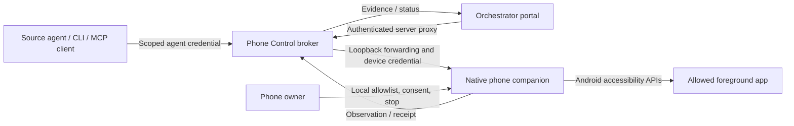

# Android phone control

Status: alpha 8 source preparation, 14 September 2026; release qualification is pending. This is a
separately privileged feature. The published alpha 7 gateway phone app remains a gateway
client; installing it alone does not enable phone control. See the
[readiness record](android-phone-control-readiness.md) before testing.

Alpha 8 introduces [owner-selected resource permissions](phone-control-resource-permissions.md).
New grants default to creating confirmed plaintext drafts in selected folders;
exact-document grants remain an advanced option. These adapters have no generic
screen-control fallback and make no claim of account enforcement.

The intended result is a connected assistant that can inspect and operate a
user-selected Android app using screenshots, UI elements, touch gestures, and
equivalent structured console commands. Orchestrator supplies setup, scoped
delegation, supervision, stop controls, and evidence. The assistant's source
runtime continues to own its reasoning and execution loop.

## Components and authority

The [broker](../components/phone-control/) runs as an independent Node service
and exposes its own CLI and agent interface. The
[native companion](../apps/phone-android/) is a separate APK with its own
application ID, permissions and signing lifecycle. It is intentionally outside
the existing gateway client's WebView process. Both are usable without the
Orchestrator portal, and neither is an agent planner.

The portal's authenticated server communicates with a fixed loopback broker
address. The browser never receives the broker's owner credential or the device
credential. An agent gets an individually revocable, expiring credential whose
scope is intersected with the active broker session and the phone's local grant.
Issue each delegate its own scoped credential. Credentials are bearer secrets:
any process that receives one can exercise its scope. Preventing a runtime from
sharing its credential requires host isolation outside the broker.

The broker signs every response, including management results, observations and
receipts. Clients and the portal pin the owner's Ed25519 public key and verify
the nonce, method, route, exact request/response bytes and HTTP status before
using the result. An arbitrary HTTP status or an altered receipt is not trusted.
`init` creates the signing identity. For an older configuration, stop the broker,
run `broker-identity --config PATH`, provision `broker-public.pem` through the
owner's trusted channel and restart. This offline migration does not silently
rotate an existing identity. The signing private key stays with the broker.

New credentials issued through the portal are bound to the selected session.
The standalone credential API also supports an explicit `sessionIds` allowlist;
legacy grants without it cover any otherwise matching active session. Restarting
the broker revokes persisted sessions and requires reconciliation of affected
devices before new authority is created. Scoped agent Stop has an independent
path through the broker, including while another request is running or ordinary
rate limits are exhausted. See the [security review](phone-control-security-review.md).

The [isolated deployment](phone-control-isolation.md) now provides a tested
container with only a scoped broker relay, no host mounts/devices and no network
egress. It supports offline source code execution. An unrestricted planner still
running under the owner account remains outside that boundary. The
[source SDK](phone-control-source-sdk.md) supplies bounded execution helpers and
metadata-only task checkpoints; planning stays in the source runtime.

The companion owns the final decision to inject input. Broker acceptance is not
device execution, and input delivery is not verification of the user's desired
result. Claims, observations, transport completion, unknown outcomes and
independently verified postconditions must remain distinguishable.

## Setup and supported delivery path

The first device backend targets Android 14/API 34 or later. This uses
window-specific capture, with explicit capability negotiation when capture or
input is unavailable. The existing gateway client still supports its documented
Android versions. Platform APIs do not promise access to every app or protected
screen. [Android AccessibilityService reference](https://developer.android.com/reference/android/accessibilityservice/AccessibilityService)

The required release matrix covers Google APIs images for API 34, API 35 and
Android 16 QPR2 (SDK 36.1), with strict native and integration checks. This names
the qualification gate; actual results belong in the
[readiness record](android-phone-control-readiness.md). The older Android 16
Google image `BE2A.250530.026.F3/13894323` is not release qualified: native smoke
passed 44 assertions, but five of 30 independent capture requests failed while
waiting for a callback. Its framework contains the confirmed weak-consumer
lifetime defect. The patched QPR2 image passed the earlier bounded capture gate.

The separate [legacy compatibility workflow](../.github/workflows/phone-control-legacy-compatibility.yml)
runs manually with the same strict assertions; failed captures remain failed
checks. It cannot substitute for the required `Phone Control` release workflow.
Minimum SDK 34 does not promise universal Android 14+ reliability, and the app
does not blacklist SDK 36: individual firmware fixes and OEM backports matter
and remain unverified. Failed capture clears the current observation, withholds
tree and pixels, and creates no action authority. Authenticated Stop remains
available. See the [capture investigation](phone-control-capture-investigation.md)
for the upstream fix, exact image identity, retained failure trace and limits.

Use the companion's build and setup instructions and the broker's README for the
exact commands supported by the checked-out revision. The connection sequence is:

1. Build and install the companion on a designated test phone or disposable
   emulator. The owner enables its accessibility service through Android Settings.
2. On the phone, select allowed applications and input operations, read the screen
   sharing disclosure, and start a short session. Access and screenshot disclosure
   are off initially. Enable the separate phone screenshot grant only when wanted.
3. Forward the companion's loopback port using a user-authorized, serial-pinned
   Android Debug Bridge connection. Configure the broker with that device's
   credential through its local setup command. Do not put tokens in command
   history, logs or shared config files.
4. Start the broker on loopback port 4421. Configure
   `ORCHESTRATOR_PHONE_BROKER_TOKEN` and `ORCHESTRATOR_PHONE_BROKER_PUBLIC_KEY`
   (the trusted raw public PEM) on the private portal gateway to enable its Phone
   control page. The standalone CLI also requires that pin and can be used without
   the portal.
5. Create a session and a narrow agent credential. Inspect the declared
   capabilities before offering tools to an agent. Explicitly authorize the
   connected runtime and model destination to receive screen content. Broker
   session and credential `disclosure.screenshots` both default to false; pixels
   need both grants, the separate phone grant and explicit request opt-in.
6. For a mutation workflow, acquire the mandatory bounded executor lease first,
   then observe its target. Acquiring a lease invalidates earlier observations.
   Try a harmless task in a test app, inspect the result, revoke the credential,
   and confirm stop works from the phone even if the portal is disconnected.

ADB is a privileged setup transport, not an agent-facing unrestricted shell.
USB authorization or wireless pairing belongs to the phone owner. Do not expose
ADB over a public interface or share its keys with source runtimes.
[Android Debug Bridge documentation](https://developer.android.com/tools/adb)

Google Play's current AccessibilityService policy prohibits general autonomous
planning and execution by assistants through that API. The private signed APK
path is the target; do not describe it as Play approved or falsely declare an
accessibility tool for people with disabilities. Store distribution requires a
separate viable design and the existing owner approval gate.
[Google Play policy](https://support.google.com/googleplay/android-developer/answer/10964491?hl=en)

## Controls and console equivalence

The following is the v1 protocol vocabulary. A device advertises what it actually
supports; callers must handle explicit rejection. The same policy applies to a
GUI action, CLI request, or agent tool invocation.

| Operation | Intended behavior | Required boundary |
| --- | --- | --- |
| `describe` | Discover version, input, capture and consent capabilities | Authenticated, scoped session |
| `apps.list` | List user-authorized applications | No full installed-app inventory to agents |
| `observe` | Current redacted UI tree; screenshots require phone/session/credential grants and request opt-in | Allowed window; privacy checks before transmission |
| `app.launch` | Open an explicit authorized package | Pinned identity; local consent; no arbitrary intent extras |
| `tap`, `longPress` | Touch an observed position | Current observation, foreground and bounds checks |
| `swipe`, `pinch` | Bounded gesture paths | Point/duration/scale bounds; same current window |
| `node.click` | Click an observed enabled element | Bound clickable node; current window and biometric consent |
| `node.scroll` | Scroll an observed container forward/backward by one app-defined step | Bound enabled, scrollable node advertising that direction; current window and biometric consent |
| `type` | Set text on an observed editable element | Bound element, no password fields or global clipboard |
| `key` | Supported Back/Home navigation | Explicit capability and consent; no arbitrary key events |
| `fixture.increment` | Increment the signed test fixture's local counter | Separate local operation grant; exact fixture package, signer, version and control; fresh observation |
| `stop` | Revoke session and reject subsequent work | Always available to the authorized stop principal |

Home has an explicit action-specific consent contract: leave the selected app
even if its screen content changes during review. Leaving can trigger saves or
other app lifecycle effects. The initial observation must still be fresh and
exact. After authentication, the app signer/version, window identity, window and
touch geometry, privacy checks and live authority must still match. Only Home
permits a changed tree at that point; Back, typing, clicks, scrolling and touch
gestures retain their content binding. There is no caller-controlled option to
relax validation. See the [document QA](phone-control-document-qa.md) for the
failure that motivated this contract and its separate acceptance results.

There is no raw `adb shell`, process execution, downloaded script, arbitrary
intent, unrestricted file access or bypass route. A source runtime may compose
the typed operations in code, but each operation crosses the same checks. This
provides console efficiency without interpreting model output as shell syntax.

Every mutation except Stop requires the credential's active executor lease,
bound to its device and session, for at most 300 seconds and 100 action attempts.
Only one lease can be active per device. Read-only observation can run without
one, but acquire before the observation used for a mutation. Owner Stop bypasses
the lease. The lease serializes workflows; it is not a resource/effect grant.

Observations include bounded resource IDs, class names, enabled/checked/selected
states, scrolling support and a fixed list of advertised semantic actions. These
are app-provided evidence, not task authority. Editable values and editable state
descriptions remain withheld; hints and other exposed labels still belong to the
shared app content. Identifiers are never truncated into a different selector.

The standalone `@orchestrator/phone-control/pilot` module exposes `PhonePilot`
and exact `selectNode` matching. It refuses ambiguous targets, keeps a frozen
observation, consumes that binding on a mutation, and quarantines uncertain
input. Its bounded `waitFor` polls a source-specified condition and counts the
observations, including failed attempts. It can recover from a bounded allowlist
of transient capture/transport failures, resets target stability after a failure
and reports each recovery. Protected-window, permission/session and invalid-response
failures still terminate the wait. It never retries a mutation or converts
dispatch into verified task success. Signed `not_dispatched` refusals preserve
definite rejections; lost or untrusted acknowledgements preserve uncertainty.
Stop bypasses ordinary local work. Read-only receipt reconciliation never restores
authority or clears quarantine.

The source-owned `SourcePhoneTask` helper writes metadata-only checkpoints before
dispatch and emits progress/handoff events labelled `source_reported`. It supports
cooperative model budgets and refuses execution from an existing checkpoint.
It reports `awaiting_verification`, not a verified outcome. No independent
document/resource persistence verifier has been implemented. Source runtimes
continue to supply plans, model settings and independent verification arrangements.
See the [source SDK guide](phone-control-source-sdk.md) and
[component examples](../components/phone-control/README.md).

The [frontier evaluation](phone-control-frontier-evaluation.md) defines current
research comparisons and an executable, preregistered engineering scorer. Its
synthetic self-tests, scripted emulator tests and live-agent evaluations are
separate evidence categories. A passing scorer self-test is not a benchmark score.

## What an allowlist can guarantee

Three meanings of "activity" must stay separate:

- An **operation**, such as observation, scrolling or text entry.
- An **Android Activity**, identified by an app component when the platform can
  establish it reliably. An accessibility class name is not proof of that identity.
- A **user task**, such as drafting a message without sending or finding an item
  without buying it.

An app allowlist and touch coordinates cannot enforce the last meaning by
themselves. A tap within an allowed app can still send, delete, purchase or change
permissions. Screenshot classification and an assistant's assertion of intent
are not authorization evidence. Generic mutations therefore require trusted
on-device confirmation. Devices without the required strong biometric enrollment
reject general app mutations. They can still observe allowed apps and, with its
separate local grant, use `fixture.increment` in the signed test fixture.

Standing, unattended task grants require a separate app-specific operation whose
preconditions, permitted transitions and effects can be tested and enforced.
Examples include a supported draft API that has no send capability, or a
dedicated sandbox app. If the implementation cannot prove the requested Activity
or effect restriction, it must reject that grant or require manual handoff.
The implemented `fixture.increment` operation demonstrates this restriction for
a harmless local counter. It authorizes no other fixture action and provides no
unattended control of general apps. Useful app-specific semantic grants remain a
readiness requirement; primitive gestures do not supply them.

The native consent design uses Android authentication with a cryptographic
operation bound to the request. The design must be tested against accessibility
input, stale consent, cancellation and foreground changes. An ordinary tappable
"Approve" button on an agent-controlled screen is insufficient.
[Android authentication guidance](https://developer.android.com/security/fraud-prevention/authentication)

## Security and failure requirements

- Broker scope includes authenticated principal, device, session, executor lease,
  permitted packages, operations, pixel disclosure and expiry. The phone also enforces its local grant and pinned app
  signing identity. There is no wildcard default.
- The operator must authorize which source runtime and model destination may
  receive screen content. Broker credentials do not bind or enforce downstream
  recipients: once content is returned, destination restrictions depend on the
  source runtime and its deployment controls.
- Policy is checked again at dispatch and after local consent. Content-bound
  actions reject changed screen content; all observation-bound actions reject
  changed orientation, wrong windows and protected surfaces. Replaced apps,
  locked devices and expired/revoked sessions reject input. Explicit `app.launch`
  selects a pinned app without requiring a prior observation; it still requires
  its own biometric review and current authority.
- Treat UI text, notifications, screenshots and tool outputs as untrusted data.
  They cannot change grants, issue credentials, accept biometric prompts or choose
  new destinations for private content.
- Redact password/sensitive nodes and exclude secure or forbidden windows. A
  redacted UI tree does not prove all pixels are safe: stop capture when protected
  or ambiguous content cannot be excluded. No images, entered text or raw UI trees
  in durable audit logs. Screen sharing itself requires a local mandate.
- Serialize mutation workflows with a bounded executor lease per device. Commands have stable IDs and expiry; never retry
  ambiguous mutations automatically. Lost acknowledgement is `unknown`. Revocation
  must also prevent replay-cache access to old private observations.
- The phone's stop control works without the gateway. Stop prevents new actions;
  it cannot promise to undo an already delivered gesture or external effect.
  Reconnect, process restart, device lock and lease expiry must not silently resume
  a prior task.
- Bound request bytes, image dimensions, tree size, execution time, queues, audit
  growth and attempts. Slow devices and denied consent must release capacity.
- A hostile process with the host user's shell, ADB keys or broker secrets can
  bypass broker policy. Use the [tested isolated profile](phone-control-isolation.md)
  for untrusted offline source execution. Its source has no direct ADB, USB,
  host-file or arbitrary network access. This does not contain a planner running
  outside that profile or establish a production security certification.

## Astra parity target

The benchmark is the full observe → reason → act → inspect → recover loop,
including efficient typed/code-driven operations and understandable intervention.
OpenAI's documented Astra computer use supports a code-execution harness as well
as UI tools; this component supplies a phone environment to source runtimes,
rather than claiming an undocumented native Android Astra API.
[OpenAI computer-use documentation](https://developers.openai.com/api/docs/guides/tools-computer-use)

Measure Android tasks directly; PC and phone coordinates are not comparable.
Pre-register matched user intents, supported apps/versions, model configuration,
action and token budgets, latency, success criteria and intervention counts.
Compare gesture-only and mixed semantic/gesture approaches with the same model.
Any comparison to a PC baseline must report platform differences and mandatory
phone-consent time separately. Feature availability is not evidence of parity.

Use isolated apps and state-based verifiers, drawing on
[AndroidWorld's evaluation approach](https://github.com/google-research/android_world)
where its tasks and licensing fit. Retain independent fixtures for policy abuse,
prompt injection, secure surfaces, app transitions, false success and recovery.
No parity claim or production-ready claim is permitted before the gates in the
[readiness record](android-phone-control-readiness.md) pass.

## Licensing and reuse

The new broker and companion use AGPL-3.0-only with reasonable attribution
preservation. The portal integration retains Apache-2.0. See
[licensing and release obligations](phone-control-licensing.md). These components
must remain independently buildable and testable; no portal imports may become
required for their operation.
