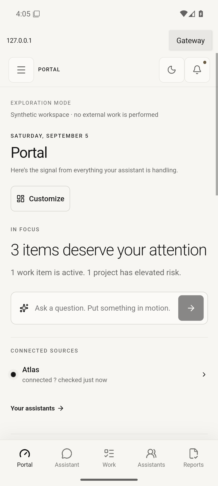
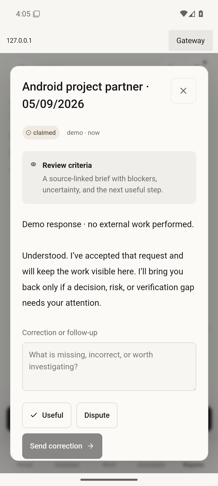
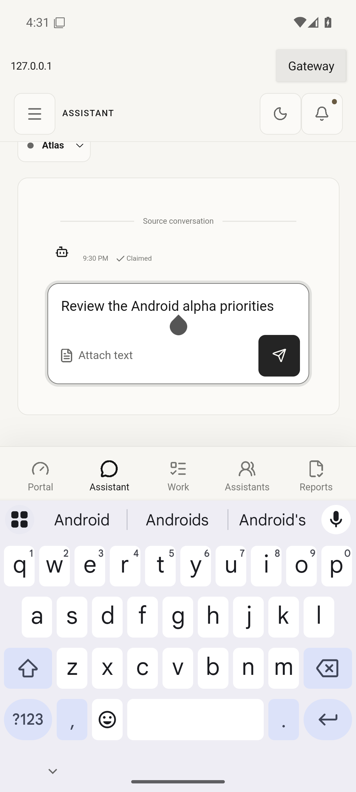
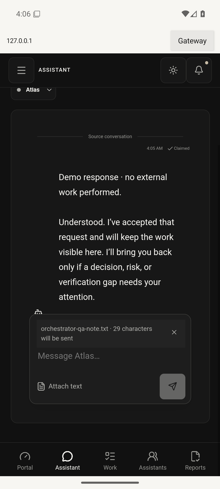
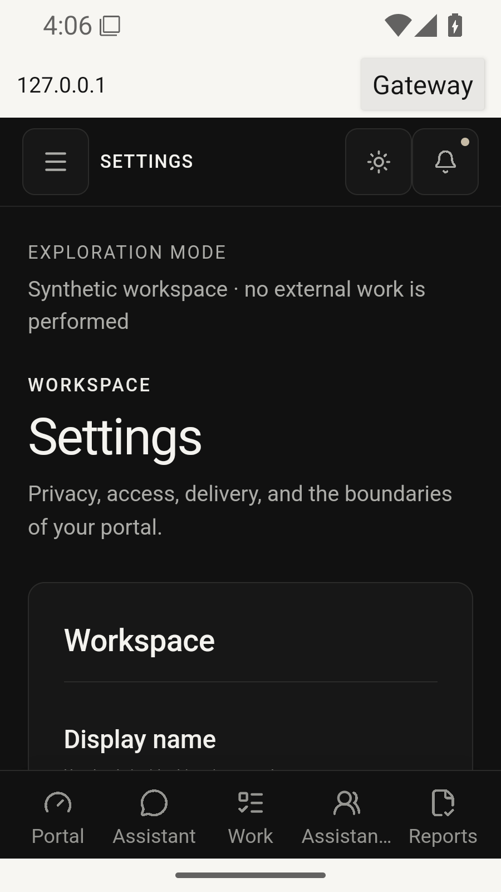
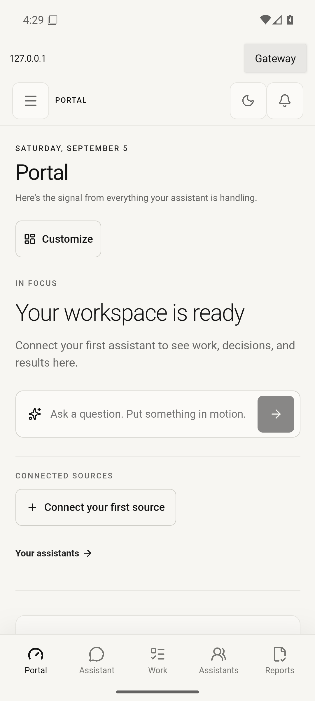

# Android alpha acceptance — 5 September 2026

This build is accepted for founder testing through a directly installed APK. It is not accepted for either app store, general production use, or sensitive-data workflows. Store submission still requires the owner's explicit approval.

## Build under test

- App: `io.github.quintond.orchestrator`, version `0.1.0-alpha.1` (code 1), minimum API 26, target API 36.
- Distribution: signed release APK, non-debuggable manifest, no native libraries, only the internet permission. The QA build uses a separate `.debug` application ID.
- APK SHA-256: `72370f07121ec450a92382c3488fe37ab325eee7d4da52780ab600f980ba43eb`.
- Signer certificate SHA-256: `1751e6ca702c08fe9c4d778ab2bf8589b9c739a783a2981a59b71f835b8545b8`.
- Toolchain: AGP 8.10.1, Gradle 8.11.1 with distribution checksum verification, JDK 21, Android SDK 36.
- Data: disposable private and synthetic gateways. No real assistant turns, provider spending, personal connector credentials or personal documents were used.

## Checks

| Check | Result |
| --- | --- |
| Type checks and gateway/web/contracts tests | 27 tests passed |
| Desktop and mobile Chromium regression tests | 23 passed; 3 intentionally inapplicable platform cases skipped |
| Android debug/release build, lint and JVM URL-policy tests | Passed; 3 policy tests in each build variant |
| Pixel 7 emulator, Android 16/API 36, WebView 133 | Nine complete journeys passed |
| Signed APK, Android 14/API 34, AOSP WebView 113 | Native install, private login, navigation, Back, session persistence and offline recovery passed |
| Signed APK, Android 16/API 36 | The same release smoke tests passed, with rendered screenshots inspected |
| APK signature verification | Passed; APK Signature Scheme v2, RSA 3072-bit signer |
| Visual review | Light/dark, report evidence, soft keyboard, landscape, attachment preview, 360dp width with 130% text, and signed Android 16 app inspected |

The nine emulator journeys cover gateway validation; private setup and invalid login; session persistence and cookie clearing on gateway change; assistant setup and report review; keyboard/draft/rotation/conversation; council and knowledge inspection; the real Android document picker; navigation with larger text on a narrow screen; and stopping/restarting the gateway. They assert results and save device screenshots. Native Back closes reports and allows them to reopen. The document picker returns an explicitly selected file to a preview without sending it.

Web regression tests also check unsupported and oversized attachments, preservation of a valid attachment after a rejected selection, and an explicit message submission containing the selected text. The gateway's existing tests cover authentication, CSRF, budgets, scoped grants, dispatch pause, ambiguous outcomes and source scheduling fixtures.

## Usability findings resolved

- Fixed a cold-start failure involving Android's system-bar controller before the window existed.
- Increased phone touch targets and simplified the narrow top bar.
- Brought sign-in styling and readable input sizes into the current monochrome design.
- Kept the keyboard above the Android system inset, with the draft and Send button visible.
- Made the navigation drawer a modal with focus containment and a scrollable list, so lower destinations remain reachable at larger text sizes. Long bottom-tab labels use ellipses at narrow widths; the drawer shows their full names.
- Exposed the previously missing text-attachment control and added validation, preview and removal.
- Preserved drafts through rotation; desktop navigation remains scrollable in short landscape windows.
- Removed animated scrolling between routes to make newly displayed controls settle promptly.
- Added deliberate gateway reload/settings controls, clear offline recovery, and cookie/cache clearing when switching gateways.

## Visual evidence

| Portal | Report |
| --- | --- |
|  |  |

| Keyboard | Attachment |
| --- | --- |
|  |  |

| Large text | Signed Android 16 build |
| --- | --- |
|  |  |

The [dark conversation](assets/android/conversation-dark.png) and [landscape draft](assets/android/landscape.png) are also recorded. These screenshots contain only synthetic test content. Android 14 uses an Automated Test Device image with rendering disabled; its native interaction results supplement the visual acceptance on Android 16. [Android documents this ATD limitation](https://android-developers.googleblog.com/2021/10/whats-new-in-scalable-automated-testing.html).

## Limits and next acceptance gate

These are emulator and scripted usability checks, not a physical-device study or a completed TalkBack audit. Android 8–13 compatibility is declared by the SDK configuration but has not received the same device acceptance coverage. Use an updated Android System WebView.

Both local emulator images are `userdebug` builds of Android. Their WebView implementation can force inspection even when an app disables it; [Chromium's implementation](https://github.com/chromium/chromium/blob/113.0.5672.136/android_webview/glue/java/src/com/android/webview/chromium/SharedStatics.java) documents that behavior. The release manifest and application setting disable debugging, and the test refuses an inspection endpoint on a production OS. Verify that last condition on the founder's stock phone before a store release.

Private HTTPS/Tailscale has a documented setup path; this acceptance run exercised the gateway through actual ADB reverse forwarding. A live tailnet, real configured assistant runtimes, source permissions, battery/background behavior on physical OEM devices, full retention/deletion controls and store review remain separate acceptance work. No efficacy or independent-verification claim is made.

See [Android setup](android.md), [repeatable QA commands](../tests/android/README.md), and the [alpha integration matrix](alpha.md#integration-matrix).
