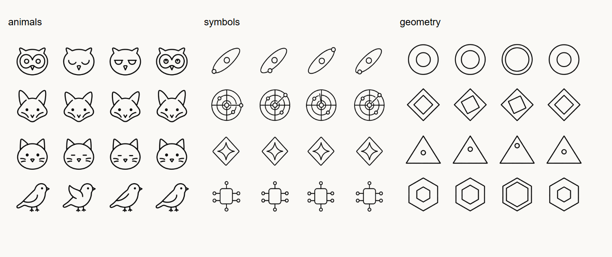

# Assistant sprites and working demo

The September 6 refinement adds three generated, transparent icon atlases and a
disposable demo that exercises the same app and gateway code as a private workspace.

## Try it

Run `npm run demo`, then open **http://127.0.0.1:4425**. Each launch creates a new
synthetic workspace in the system temporary directory. It contains Atlas, Sage,
Relay, projects, an attention queue, knowledge, messages, usage history and a
sample report. Stop it with Ctrl+C. The normal gateway and its data stay separate.

Request a report from an assistant, open it in Reports, then send a correction.
The demo returns a prepared brief and a separate revision while retaining the
original. Responses explicitly describe their simulated nature. They are claims,
never verified outcomes. The demo adapter does not contact a model or execute work.

## Icon sets

Open **Assistants → Icon themes** (the shapes button) or **Settings → Assistant
icons**. Select a theme to apply it immediately. The preference stays on this device
and synchronizes across its browser tabs. Preview animation is available in the picker.

| Sheet | Rows, from top to bottom |
| --- | --- |
| [Animals](../apps/web/public/assets/assistants-animals.png) | Owl, Fox, Cat, Bird |
| [Futuristic](../apps/web/public/assets/assistants-symbols.png) | Orbit, Radar, Portal, Circuit |
| [Geometry](../apps/web/public/assets/assistants-geometry.png) | Circles, Diamonds, Triangle, Hexagons |

Each sheet has four columns of successive animation frames and four icon rows:
12 icons, 48 frames in total. The source files have real alpha. CSS masks tint
their strokes with the current foreground colour in light and dark themes.
Rows are assigned automatically from the assistant name and remain stable through
sorting and filtering. Names and status labels remain visible; an icon is decoration,
not the sole carrier of identity or work state.

Working requests advance through four frames at 450 ms each. Ready and paused
assistants use frame zero. Reduced motion disables frame changes, including previews.
The same set appears on assistant rows and conversation avatars. Files are preloaded
to avoid blank icons when switching themes. There are no new dependencies.

The built-in image generation tool was used through the `imagegen` skill. The
animal sheet was simplified after review at phone size. A row-boundary defect in
the futuristic sheet was redrawn; an opaque checkerboard revision was rejected
and replaced with a real-alpha version. Source dimensions differ slightly, so
the renderer uses proportional quarter-sheet coordinates rather than fixed pixels.
Generation prompts and output dimensions are in
[assistant-sprites-prompts.json](assistant-sprites-prompts.json).

Selected final screenshots: [phone picker](assets/sprites/picker-mobile.png),
[assistant rows](assets/sprites/assistants-mobile.png),
[conversation](assets/sprites/conversation-mobile.png),
[Insights](assets/sprites/insights-mobile.png),
[Android picker](assets/sprites/picker-android.png).

## Usability findings and fixes

| Finding | Result |
| --- | --- |
| Page introductions repeated headings and consumed phone space | Short descriptions replace repeated slogans and category labels. |
| Assistant summaries and controls consumed too much vertical space | Compact rows, 48 px icon cells, two-line summaries; full purpose and last-request detail remain in the assistant dialog. |
| Empty status filters suggested creating another assistant | A specific empty state offers **Show all assistants**. Report filters get the same recovery. |
| Phone conversation composer could fall behind bottom navigation | The conversation fits the dynamic viewport; history scrolls independently. The send control stays above navigation at regular and compact heights. |
| A recent notification could cover the composer when the keyboard was open | Notifications now appear near the top; the send control remains clear. |
| Mobile Insights stacked four large metrics before the chart | A two-column metric summary brings the chart closer to the initial viewport. |
| Initial animal artwork was too detailed at small sizes | Simpler faces and silhouettes retain distinct character at actual display size. |
| A generic demo acknowledgment failed to demonstrate reporting value | Report requests now return a prepared sample brief with a decision, progress, sources and limits; corrections create separate revisions. |

## Verification

The full regression suite is followed by focused checks and screenshots for final
asset and layout adjustments. This is an automated
task walkthrough and visual heuristic review, not a study with recruited users.

- `npm run check`: type checking and 68 unit/integration tests passed.
- `npm run test:e2e`: 63 browser tests passed; three intentional platform-specific
  skips. Coverage includes setup, drafts, attachments, report review/correction,
  pause/resume, councils, watches, knowledge, connector recovery, themes, reduced
  motion, failed requests, filters and navigation.
- `npm run test:android`: all 11 native/WebView journeys passed, including private
  authentication, keyboard, rotation, document pickers, large text, all 12 routes,
  and offline recovery.
- Final targeted browser pass: 16 tests passed, including per-cell alpha/boundary
  validation for all three atlases.
- `node tests/android/visual.mjs`: 14 captures; theme persistence and animation
  verified in the actual Android WebView.
- `node tests/design-capture.mjs`: 48 route/viewport/theme combinations, plus
  picker and icon variants. Checks overflow and browser exceptions; creates an
  image gallery at `test-results/design-review/index.html`.

The Android run initially encountered a system Gboard stylus tutorial intercepting
test input. The disposable emulator now disables handwriting during QA, and native
fills verify their exact value before continuing. This was a test-environment failure.

Live external provider calls, native recurring schedules, production phones and
TalkBack need separate integration/accessibility validation. This pass does not
establish those results. The native Android toolbar follows the device theme;
the web theme switch still applies only to the WebView.
